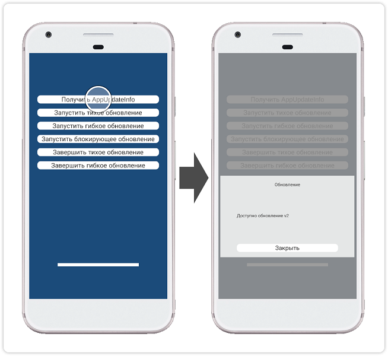
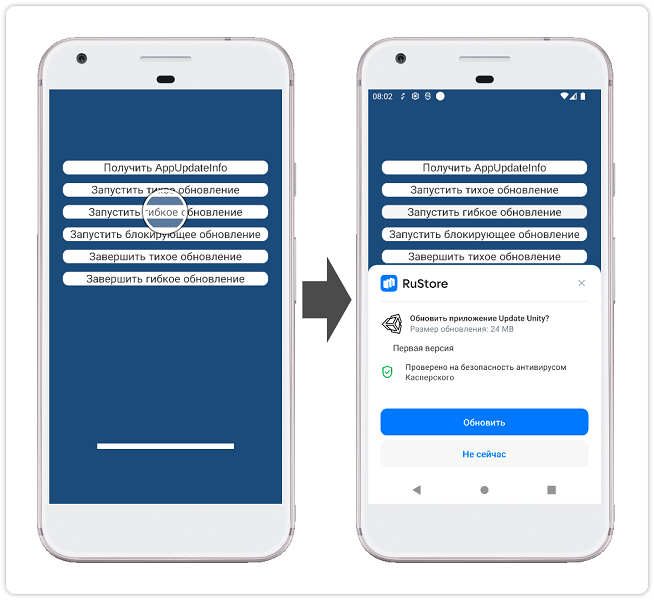
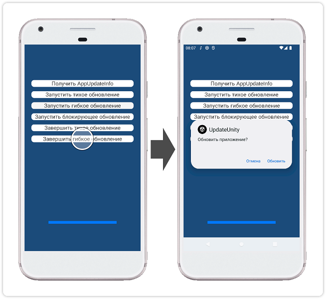

<!-- ── Language switch (RU active) ──────────────────────────────────── -->

  
    RU
  
    [EN][en]
  

<!-- ────────────────────────────────────────────────────────────────── -->

> ⚠️ Не используйте кнопку "Код → Скачать" на сайте GitFlic – этот метод не загружает файлы из Git LFS. [Инструкция по клонированию](../README_CLONE.md).

### Unity-плагин RuStore для обновления приложения

#### [🔗 Документация разработчика][10]

#### Условия работы SDK

Для работы RuStore In-app updates SDK необходимо соблюдение следующих условий:

- ОС Android версии 7.0 или выше.
- На устройстве пользователя установлен RuStore.
- Актуальная версия RuStore на устройстве пользователя.
- Приложению RuStore разрешена установка приложений.

#### Подготовка требуемых параметров

Перед настройкой примера приложения необходимо подготовить следующие данные.

- `applicationId` — уникальный идентификатор приложения в системе Android в формате обратного доменного имени (например: ru.rustore.sdk.example).
- `*.keystore` — файл ключа, который используется для [подписи и аутентификации Android-приложения](https://www.rustore.ru/help/developers/publishing-and-verifying-apps/app-publication/apk-signature/).

#### Настройка примера приложения

1. Откройте проект **Unity** из папки `appupdate_example_6000`.
1. Откройте сцену **AppUpdateSampleScene** из папки `Assets / RuStoreAppUpdateExample / Scenes`.
1. В разделе **Publishing Settings** (**Edit → Project Settings → Player → Android Settings**) выберите вариант **Custom Keystore** и задайте параметры **Path / Password**, **Alias / Password** подготовленного файла `*.keystore`.
1. В разделе **Other Settings** (**Edit → Project Settings → Player → Android Settings**) настройте раздел **Identification**, отметив опцию **Override Default Package Name** и указав `applicationId` в поле **Package Name**.
1. Выполните сборку проекта командой **Build** (**File → Build Settings**) и проверьте работу приложения.

#### Сценарий использования

##### Проверка наличия обновлений

Тап по кнопке `Получить AppUpdateInfo` выполняет процедуру [проверки наличия обновлений][20].

##### Запуск скачивания обновления

Тап по кнопке `Запустить гибкое обновление` выполняет процедуру [запуска скачивания обновления][30].

##### Установка обновления

Тап по кнопке `Завершить гибкое обновление` выполняет процедуру [установки обновления][40].

#### История изменений

[CHANGELOG](../CHANGELOG.md)

#### Условия распространения

Данное программное обеспечение, включая исходные коды, бинарные библиотеки и другие файлы, распространяется под лицензией MIT. Информация о лицензировании доступна в документе [MIT-LICENSE](../MIT-LICENSE.txt).

#### Техническая поддержка

Дополнительная помощь и инструкции доступны в [документации RuStore](https://www.rustore.ru/help/) и по электронной почте support@rustore.ru.

[10]: https://www.rustore.ru/help/sdk/updates/unity/10-5-1
[20]: https://www.rustore.ru/help/sdk/updates/unity/10-5-1#checkavailable
[30]: https://www.rustore.ru/help/sdk/updates/unity/10-5-1#scenariodelayedupdate
[40]: https://www.rustore.ru/help/sdk/updates/unity/10-5-1#installupdateflexible

[en]: README.en.md
